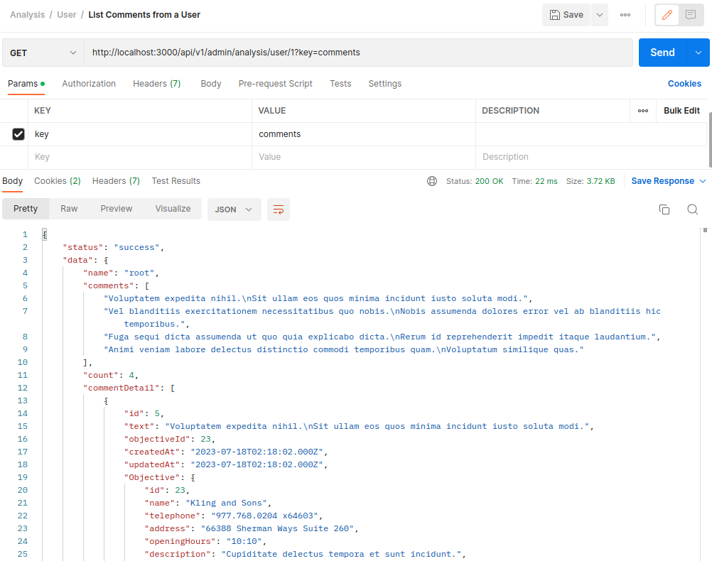
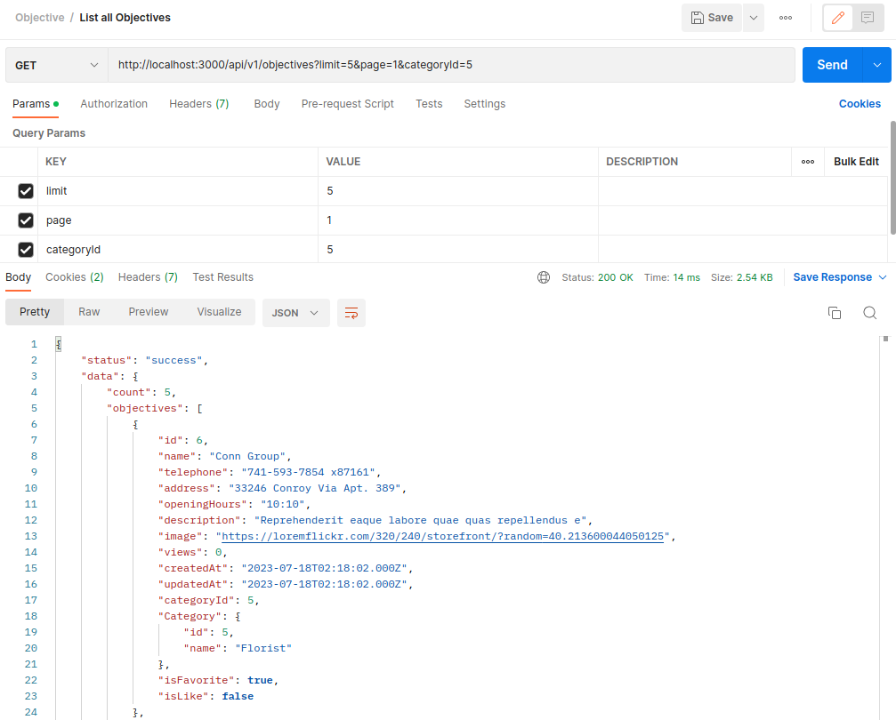
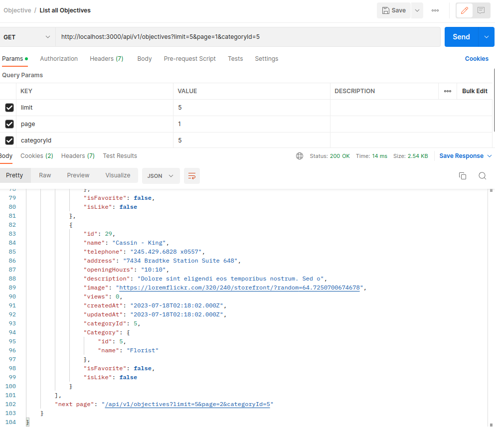
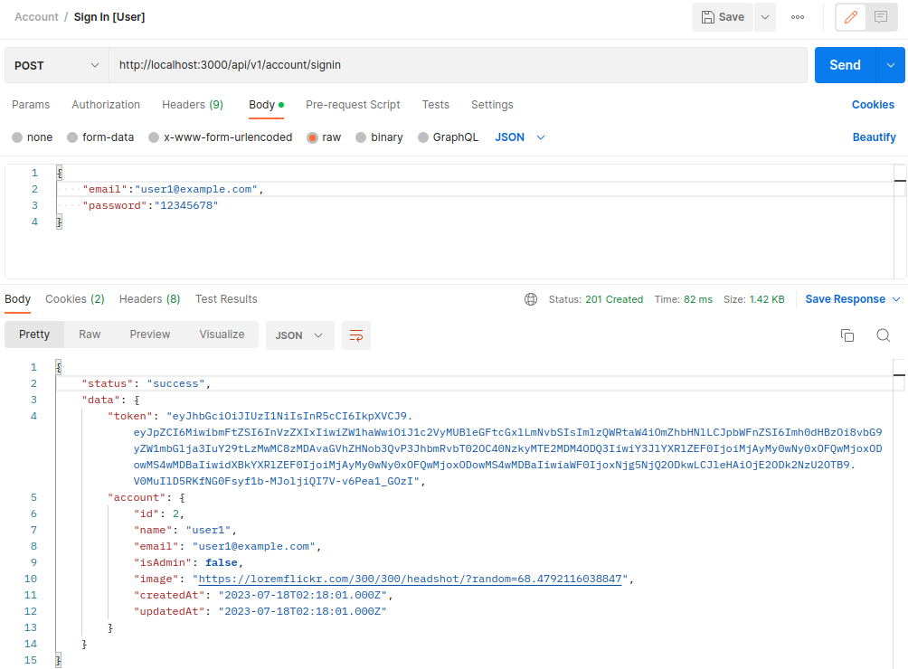

# Forum API Skeleton for Any Objectives
**This project has a robust infrastructure that allows you to quickly build a forum for any objective**
>A Node.js REST API build using Express, Sequelize and more.

## Features
This API provides two types of privileges: Admin and User.
1. Admin privilege:
	+ Manipulate object
		- Create、update and delete object
		- Categorize object.
	+ Manage category
		- Create、update and delete category
	+ Analysis (work in progress)
		- Comments of a specific object
		- Comments from a specific user
		- Objectives that a specific user has commented on or favorited
2. User privilege
	+ Get a list of objects
	+ View detailed information about objects
	+ Favorite and like objects
	+ Leave comment on objects
	+ Follow other users

In addition, the API includes the following features:
+ A feed displays the most recently created objectives and comments
+ A list of the popular objectives and followings
+ Account registration、login and logout.
+ User profile and dashboard for managing personal settings and activities

## Table of Contents
+ [How To Use](#how-to-use)
+ [Directory Stucture](#directory-stucture)
+ [Models](#models)
+ [API Endpoints](#api-endpoints)
+ [Seed Data](#seed-data)
+ [User and HTTP Request Authentication](#user-and-http-request-authentication)

## How To Use
```
1. Clone this repository
$ git clone https://github.com/dianaguu/forum-api-skeleton.git

2. Navigate to the repository
$ cd forum-api-skeleton

3. Install dependencies
$ npm install

4. Create a .env file (refer to .env.example) and set the environment variables accordingly

5. Configure your database in the "/forum-api-skeleton/configs/database.js" file

6.1. Build Database once for all
$ npm run database

6.2. Build Database in steps
a) Create database
   $ npm run db:create
b) Migrate database
   $ npm run db:migrate
c) Setup seed data
   $ npm run db:seed

7. Run the app
$ npm start
```
[&#8679; Back to Top](#table-of-contents)

## Directory Stucture
+ `/routes` navigates incoming HTTP requests and leads to a chain of middlewares.
+ `/middlewares` preproceses HTTP requests, or handles third-party modules.
+ `/controllers` (share the identical structure with routes) 
	- passes the necessary data of HTTP requests to services
	- receives the processed result from services, then the controller will generate a response to send back to the client.
+ `/services` contains business logic implementation, such as database access or external API calls.
+ `/pages` provides an intuitive demonstration of the project.
>By organizing the project in this way, it promotes separation of concerns and helps maintain a structured and modular codebase

```
├─ configs/
│  ├─ database.js
│  ├─ passport.js
├─ controllers/
│  └─ apis/
│  │  └─ admin/
│  │  │   ├─ analysis.controller.js
│  │  │   ├─ category.controller.js
│  │  │   ├─ objective.controller.js
│  │  │   └─ user.controller.js
│  │  └─ main/
│  │  │   ├─ account.controller.js
│  │  │   ├─ comment.controller.js
│  │  │   ├─ favorite.controller.js
│  │  │   ├─ feed.controller.js
│  │  │   ├─ follow.controller.js
│  │  │   ├─ like.controller.js
│  │  │   ├─ objective.controller.js
│  │  │   ├─ popular.controller.js
│  │  │   └─ user.controller.js
│  └─ pages/
├─ helper/
├─ middlewares/
│  ├─ apiAuthentication.js
│  ├─ errorHandler.js
├─ migrations/
├─ models/
├─ routes/
├─ seeders/
├─ services/
├─ views/
├─ app.js
```

[&#8679; Back to Top](#table-of-contents)

## Models
| Table     | Columns                                                                         | FK                                   |
| :-------- | :------------------------------------------------------------------------------ | :----------------------------------- |
| Category  | id, name        | categoryId [1 category : M objectives] |
| Comment   | id, text        | objectiveId [1 comment : 1 objective] <br> userId [1 comment : 1 user] |
| Favorite  | id, objectiveId, userId                                                         |                                      |
| Followship| id, followerId, followingId                                                     |                                      |
| Like      | id, objectiveId, userId                                                         |                                      |
| Objective | id, name <br> telephone, address, openingHours <br> description, image, views           | categoryId [1 objective : 1 category] <br> objectiveId [1 objective : M comments] <br> objectiveId as FavoriteUsers [M objective : M user] <br> objectiveId as LikeUsers [M objective : M user] |
| User      | id, name, email, password <br> isAdmin, image                                       | userId [1 user : M comments] <br> userId as FavoriteObjectives [M users : M objectives] <br> userId as LikeObjectives [M users : M objectives] <br> followingId as Followers [M users : M Followers] <br> followerId as Followings [M users : M Followings] |

[&#8679; Back to Top](#table-of-contents)

## API Endpoints
Two types of privileges: Admin and User.
### 1 Admin
##### 1-1 Objective: create、read、update and delete.
| Method     |  Endpoint                                                     | Description         |
| ------------- | -------------------------------------------------------- | ---------------------- |
| POST | http://localhost:3000/api/v1/admin/objectives | Create a Objective |
| GET | http://localhost:3000/api/v1/admin/objectives/ | List all Objectives |
| GET | http://localhost:3000/api/v1/admin/objectives/id | Get a Objective |
| PUT | http://localhost:3000/api/v1/admin/objectives/id | Update a Objective |
| DELETE | http://localhost:3000/api/v1/admin/objectives/id | Delete a Objective|

#####  1-2 User: read and control the privilege.
| Method     |  Endpoint                                                     | Description         |
| ------------- | -------------------------------------------------------- | ---------------------- |
| GET | http://localhost:3000/api/v1/admin/users | List all Users |
| GET | http://localhost:3000/api/v1/admin/users?isAdmin=1 | LIst all Admin Users |
| PATCH | http://localhost:3000/api/v1/admin/users/id | Switch the Privilege of User |

##### 1-3 Category: create、read、update and delete
| Method     |  Endpoint                                                     | Description         |
| ------------- | -------------------------------------------------------- | ---------------------- |
| POST | http://localhost:3000/api/v1/admin/categories | Create a Category |
| GET | http://localhost:3000/api/v1/admin/categories | List all Categories |
| PUT | http://localhost:3000/api/v1/admin/categories/id | Update a Category |
| DELETE | http://localhost:3000/api/v1/admin/categories/id | Delete a Category |

#####  1-4 Analysis/Objective: get comments of a specific object
| Method     |  Endpoint                                                     | Description         |
| ------------- | -------------------------------------------------------- | ---------------------- |
| GET | http://localhost:3000/api/v1/admin/analysis/objective/id?key=comments | List Comments of a Objective |

#####  1-5 Analysis/User: get comments from a specific user、get objectives that a specific user has commented on or favorited
| Method     |  Endpoint                                                     | Description         |
| ------------- | -------------------------------------------------------- | ---------------------- |
| GET | http://localhost:3000/api/v1/admin/analysis/user/id?key=commented-objectives | List Objectives a User commented |
| GET | http://localhost:3000/api/v1/admin/analysis/user/id?key=favorited-objectives | List Objectives a User favorited |
| GET | http://localhost:3000/api/v1/admin/analysis/user/id?key=comments | List Comments from a User |
| GET | http://localhost:3000/api/v1/admin/analysis/user/id?key=followers | List Followers of a User |
| GET | http://localhost:3000/api/v1/admin/analysis/user/id?key=followings |List Followings of a User |
<p align="left"> 
  
</p>

[&#8679; Back to Top](#table-of-contents)

------
### 2 User/Main
#####  2-1 Objective: get objective information and its dashboard
| Method     |  Endpoint                                                     | Description         |
| ------------- | -------------------------------------------------------- | ---------------------- |
| GET | http://localhost:3000/api/v1/objectives/id | Get a Objective |
| GET | http://localhost:3000/api/v1/objectives/id/dashboard | Get a Objective's Dashboard |
| GET | http://localhost:3000/api/v1/objectives?limit=10&page=1&categoryId=1 | List all Objectives |
<p align="left"> 
  
</p>
<p align="center"> 
  
</p>

#####  2-2 Account: registration、login and logout
| Method     |  Endpoint                                                     | Description         |
| ------------- | -------------------------------------------------------- | ---------------------- |
| POST | http://localhost:3000/api/v1/account/signin | Sign In |
| POST | http://localhost:3000/api/v1/account/signup | Sign Up |
| POST | http://localhost:3000/api/v1/account/signoff | Sign Off |
<p align="left"> 
  
</p>

##### 2-3 User: get user information and their dashboard. Also update user's profile.
| Method     |  Endpoint                                                     | Description         |
| ------------- | -------------------------------------------------------- | ---------------------- |
| GET | http://localhost:3000/api/v1/users/id | Get a User |
| GET | http://localhost:3000/api/v1/users/id/dashboard | Get a User's Dashboard |
| PUT | http://localhost:3000/api/v1/users/id | Update a User Information |

#####  2-4 Feed: get the most recently created objectives and comments
| Method     |  Endpoint                                                     | Description         |
| ------------- | -------------------------------------------------------- | ---------------------- |
| GET | http://localhost:3000/api/v1/feed/objectives?limit=10 | List recent created Objectives|
| GET | http://localhost:3000/api/v1/feed/comments?limit=10 | List recent created Comments |

#####  2-5 Popular: get the popular objectives and followings
| Method     |  Endpoint                                                     | Description         |
| ------------- | -------------------------------------------------------- | ---------------------- |
| GET | http://localhost:3000/api/v1/popular/objectives?limit=10 | List popular Objectives |
| GET | http://localhost:3000/api/v1/popular/followings?limit=10 | List popular Followings |

#####  2-6 Comment: user make a comment on object. Only Admin privilege authorized to delete comment.
| Method     |  Endpoint                                                     | Description         |
| ------------- | -------------------------------------------------------- | ---------------------- |
| POST | http://localhost:3000/api/v1/comments | Create a Comment |
| DELETE | http://localhost:3000/api/v1/comments/id | Delete a Comment |

#####  2-7 Favorite: user mark an object as a favorite or remove it.
| Method     |  Endpoint                                                     | Description         |
| ------------- | -------------------------------------------------------- | ---------------------- |
| POST | http://localhost:3000/api/v1/favorite/id | Favorite a Objective |
| DELETE | http://localhost:3000/api/v1/favorite/id | Unfavorite a Objective |

#####  2-8 Follow: user follow or unfollow other users.
| Method     |  Endpoint                                                     | Description         |
| ------------- | -------------------------------------------------------- | ---------------------- |
| POST | http://localhost:3000/api/v1/follow/id | Follow a User |
| DELETE | http://localhost:3000/api/v1/follow/id | Unfollow a User |

#####  2-9 Like: user like or dislike an object.
| Method     |  Endpoint                                                     | Description         |
| ------------- | -------------------------------------------------------- | ---------------------- |
| POST | http://localhost:3000/api/v1/like/id | LIke a Objectvie |
| DELETE | http://localhost:3000/api/v1/like/id | Unlike a Objective |

[&#8679; Back to Top](#table-of-contents)

## Seed Data
+ The data presents various types of shops(a.k.a. objectives) within the user's living circle.
	- To obtain assistance, kindly refer to Faker and LoremFlickr resources.
+ [Faker](https://github.com/faker-js/faker) tries to generate realistic data and not obvious fake data.
+ [LoremFlickr](https://loremflickr.com/) provides placeholder images for every case, web or print, on almost any subject, in any size.

| Model  | Amount  | Description  |
| ------------ | ------------ | ------------ |
| User   | 13 | To modify the root account, please edit the ROOT_EMAIL and ROOT_PASSWORD fields within the .env file. <br> For regular account access, please utilize the email user1@example.com and password 12345678. <br><br> To demonstrate the popular followings feature, generate thirteen user profiles. |
| Category  | 8  | Bakery <br> Coffee Shop <br> Clothing Shop <br> Drugstore <br> Florist <br> Hardware Store <br> Supermarket <br> Stationery Store |
| Objective  | 50  |  Objectives randomly assigned to categories |
| Comments  | 50  | Comments randomly assigned to objectives |
| Favorite  | 50 | Favorites randomly assigned to objectives |
| Followship  | 50  | Followers randomly assigned to followings |

[&#8679; Back to Top](#table-of-contents)

## User and HTTP Request Authentication
Use JWT in cookie and set httpOnly

